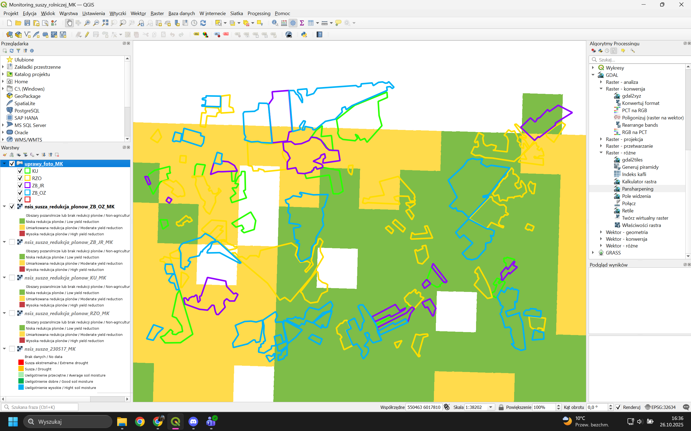
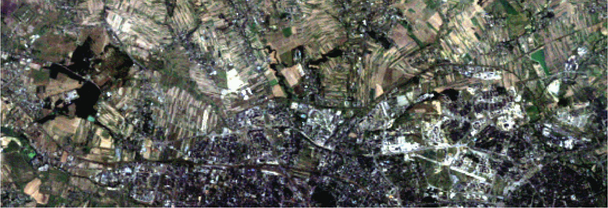
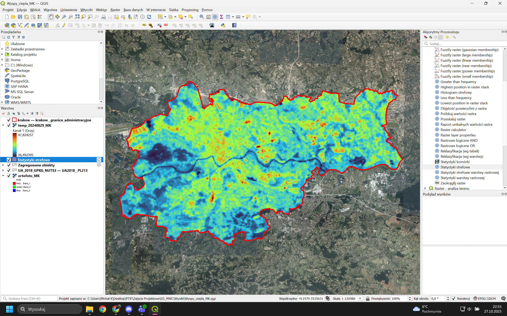
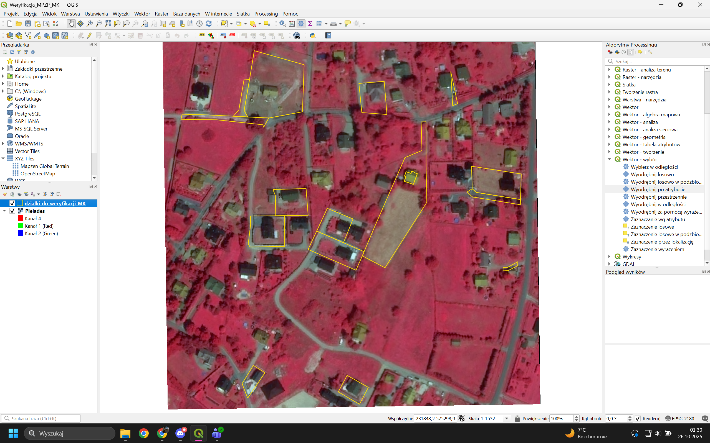

# Remote Sensing & Earth Observation

A collection of remote sensing and Earth Observation case studies developed using **satellite imagery, LiDAR, raster analysis and GIS**.

The projects explore practical applications of remotely sensed data in environmental monitoring, agriculture, urban analysis, land-cover classification and spatial planning. They use data from sensors including **Sentinel-2, Landsat 5/7/8/9, SPOT 6 and Pleiades**, together with Copernicus Land Monitoring products, digital terrain models and airborne LiDAR.

## Case Studies

### 1. [Agricultural Drought Monitoring](agricultural-drought-monitoring/)

Monitoring agricultural drought and crop conditions using **multitemporal high-resolution SPOT 6 imagery**.

The workflow included:

- comparison of imagery acquired in May and September 2023,
- creation of natural-color and color-infrared composites,
- pansharpening of multispectral imagery using the panchromatic band,
- visual identification and digitization of crop types,
- comparison with reference crop-parcel data,
- integration of drought information from the **NSIS** satellite information platform,
- interpretation of soil-moisture and expected yield-reduction conditions for agricultural parcels.

The exercise demonstrates how high-resolution optical imagery and operational satellite services can be combined for agricultural monitoring.



---

### 2. [Impervious Surface Change](impervious-surface-change/)

Multitemporal analysis of **urban impervious surfaces** using historical and contemporary orthophotography.

Impervious areas such as buildings, roads, parking areas and other sealed surfaces were manually interpreted and vectorized in **QGIS** using imagery from 2003, 2013 and current Geoportal orthophotography.

For each period, the analysis calculated:

- total impervious area,
- permeable area,
- imperviousness ratio,
- additional spatial statistics describing urban development.

The proportion of impervious surface within the analyzed area increased from approximately **28% in 2003** to **56% in 2013** and approximately **64% in the contemporary imagery**, illustrating substantial urban development and loss of permeable surface.

[View the project report](impervious-surface-change/report/impervious-surface-change-report.pdf)

---

### 3. [Land-Cover Classification](land-cover-classification/)

Supervised classification of **Sentinel-2 multispectral imagery** for the Kraków metropolitan area.

The project begins with spectral interpretation and comparison of several band combinations, including:

- true-color composition,
- color-infrared composition,
- NIR/SWIR false-color composites,
- spectral response curves for major land-cover types.

Training areas were created for six broad land-cover categories, including water, built-up areas, forests, grassland, agricultural land and bare soil.

Three supervised classification algorithms were compared using the **Semi-Automatic Classification Plugin (SCP)**:

- Minimum Distance
- Maximum Likelihood
- Spectral Angle Mapping

The resulting classifications were assessed visually against reference orthophotography and quantitatively using proportional error matrices.

The **Maximum Likelihood** classifier produced the most spatially coherent result. Training samples were subsequently refined, improving classification accuracy and reducing confusion between spectrally similar vegetation classes.

#### Outputs

- [Maximum Likelihood classification](land-cover-classification/output/maximum-likelihood-classification.tif)
- [Minimum Distance classification](land-cover-classification/output/minimum-distance-classification.tif)
- [Spectral Angle classification](land-cover-classification/output/spectral-angle-classification.tif)
- [Spectral analysis report](land-cover-classification/reports/spectral-analysis-report.pdf)
- [Classification report](land-cover-classification/reports/land-cover-classification-report.pdf)

---

### 4. [LiDAR Point-Cloud Analysis](lidar-point-cloud-analysis/)

Processing and exploration of airborne **LiDAR point-cloud data** in CloudCompare.

LAZ point-cloud data obtained from the Polish Geoportal were used to investigate basic point-cloud processing operations.

The workflow included:

- importing and visualizing LiDAR data,
- spatial segmentation of a selected property,
- generation of longitudinal and transverse cross-sections,
- separation of a building from the surrounding terrain,
- visualization using classification and intensity scalar fields,
- inspection of three-dimensional coordinates.

[View the LiDAR analysis report](lidar-point-cloud-analysis/lidar-point-cloud-analysis-report.pdf)

---

### 5. [Multitemporal Change Analysis](multitemporal-change-analysis/)

Analysis of long-term urban change using imagery from multiple generations of **Landsat and Sentinel-2** satellites.

Eight satellite observations spanning more than three decades were used:

- 1992 — Landsat 5
- 1998 — Landsat 5
- 2003 — Landsat 7
- 2007 — Landsat 5
- 2013 — Landsat 8
- 2017 — Sentinel-2
- 2021 — Sentinel-2
- 2024 — Sentinel-2

The workflow included:

- preparation of comparable multispectral imagery,
- true-color visualization,
- visual interpretation of long-term urban development,
- creation of a frame-by-frame change animation,
- detailed comparison of selected dates,
- vectorization of areas that changed between 2017 and 2021.

The project illustrates both qualitative and vector-based approaches to detecting urban change through long-term Earth Observation archives.



---

### 6. [Portugal Wildfire Severity](portugal-wildfire-severity/)

Assessment of wildfire damage in Portugal using **Sentinel-2 imagery acquired before and after a 2018 fire event**.

Images from **19 July 2018** and **23 August 2018** were processed in ArcGIS Pro.

The workflow included:

- creation of pre-fire and post-fire multispectral composites,
- calculation of the **Normalized Burn Ratio (NBR)** using NIR and SWIR bands,
- calculation of the difference NBR (**dNBR**),
- clipping of the analysis to the study area,
- reclassification of dNBR values into burn-severity classes,
- preparation of a final cartographic layout.

The project demonstrates a standard remote-sensing approach to post-fire damage assessment using spectral change.

[View the wildfire severity map](portugal-wildfire-severity/output/wildfire-severity-map.pdf)

---

### 7. [PV Site Suitability](pv-site-suitability/)

Multicriteria screening of potential locations for **photovoltaic installations** using satellite and terrain data.

The analysis combines Landsat, Sentinel and Digital Terrain Model data to evaluate four environmental criteria:

- **surface temperature > 10°C**
- **terrain slope < 6°**
- **southern aspect between 130° and 230°**
- **NDVI < 0.4**

Each criterion was transformed into a suitability layer and combined into a final raster representing areas satisfying all selected conditions.

The resulting suitability map was subsequently used to identify several candidate groups of parcels for further investigation.

The project demonstrates how remote sensing can support the **initial screening stage** of spatial investment planning; final site selection would still require field verification, legal analysis, infrastructure assessment and environmental checks.

[View the PV suitability report](pv-site-suitability/pv-site-suitability-report.pdf)

---

### 8. [Urban Heat Island](urban-heat-island/)

Analysis of **land surface temperature in Kraków** and its relationship with urban land-cover characteristics.

The project uses a **Landsat 9 Surface Temperature** product acquired on 29 August 2024 together with high-resolution Copernicus Land Monitoring datasets.

The analysis included:

- conversion of satellite surface-temperature values to degrees Celsius,
- clipping the temperature raster to the administrative boundary of Kraków,
- visualization of the spatial temperature pattern,
- comparison with contemporary orthophotography,
- zonal statistical analysis using **Tree Cover Density**,
- analysis of imperviousness and built-up surfaces,
- comparison with Urban Atlas land-cover classes.

This allows the spatial distribution of high and low surface temperatures to be interpreted in relation to vegetation, built-up areas and surface sealing.



---

### 9. [Urban Planning Verification](urban-planning-verification/)

Use of high-resolution satellite imagery to identify cadastral parcels that may require verification against **local spatial planning regulations**.

The workflow uses **Pleiades imagery**, cadastral parcel boundaries and NDVI-based vegetation analysis.

The analysis included:

- selection of cadastral parcels located entirely within the study area,
- calculation of NDVI from multispectral imagery,
- thresholding of the vegetation index to derive a raster proxy for vegetation-covered surface,
- zonal statistics for individual parcels,
- calculation of the estimated vegetation-covered proportion of each parcel,
- identification of parcels falling below a predefined planning threshold,
- visual verification using the original satellite image.

The method is intended as a **screening tool**, rather than a definitive legal assessment. NDVI identifies green vegetation and therefore does not directly reproduce the complete statutory definition of biologically active surface.



## Main Data Sources

The case studies use data and products from several Earth Observation sources, including:

- **Sentinel-2**
- **Landsat 5, 7, 8 and 9**
- **SPOT 6**
- **Pleiades**
- **Copernicus Land Monitoring Service**
- **Polish Geoportal**
- **NSIS satellite information platform**
- airborne LiDAR / LAZ point clouds
- Digital Terrain Models

## Technologies and Methods

### Software

- **QGIS**
- **ArcGIS Pro**
- **CloudCompare**
- Semi-Automatic Classification Plugin

### Remote Sensing Methods

- multispectral image interpretation
- natural-color and false-color composites
- pansharpening
- spectral-response analysis
- supervised classification
- training-sample selection and refinement
- classification accuracy assessment
- NDVI
- NBR and dNBR
- land surface temperature
- multitemporal change detection
- LiDAR point-cloud processing

### Spatial Analysis

- raster algebra
- raster reclassification
- terrain slope and aspect analysis
- multicriteria suitability analysis
- vectorization and photointerpretation
- zonal statistics
- parcel-level analysis
- cartographic visualization

## Repository Structure

```text
remote-sensing/
├── agricultural-drought-monitoring/
├── impervious-surface-change/
├── land-cover-classification/
├── lidar-point-cloud-analysis/
├── multitemporal-change-analysis/
├── portugal-wildfire-severity/
├── pv-site-suitability/
├── urban-heat-island/
├── urban-planning-verification/
└── README.md
```

## Data Availability

Large source satellite scenes and other high-volume datasets are intentionally not included in the repository.

The repository focuses on selected derived products, vector layers, project files, reports and representative results required to document the analytical workflows. Original Earth Observation datasets can be obtained from their respective data providers where access conditions permit.

## Author

**Michał Kuśnierz**

Developed during remote sensing, photogrammetry and satellite-data coursework and workshops at **AGH University of Science and Technology**.
